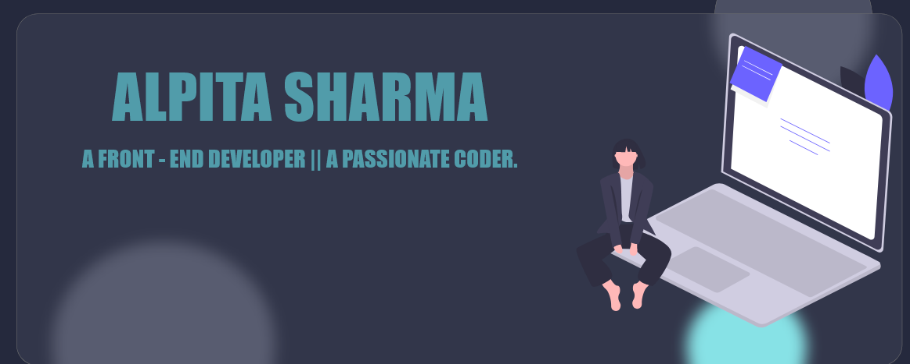

<h3 align="center" style="font-family:impact;"> Hi there 👋</h3>

I'm Alpita Sharma, a self-motivated tech enthusiast.

<h4 align="center">
💻 front-end developer || 🌱 || 💬 connect <a href="https://www.linkedin.com/in/alpita-sharma-619a981b6">@alpita-sharma 💫</a>
</h4>

<a href="https://alpitasharma2.github.io/card/">Let's get connected.</a>

  

  

<table width="100%">
  <tr>
    <td>
 </td>
 <td>  </td>
  </tr>
 <table>

