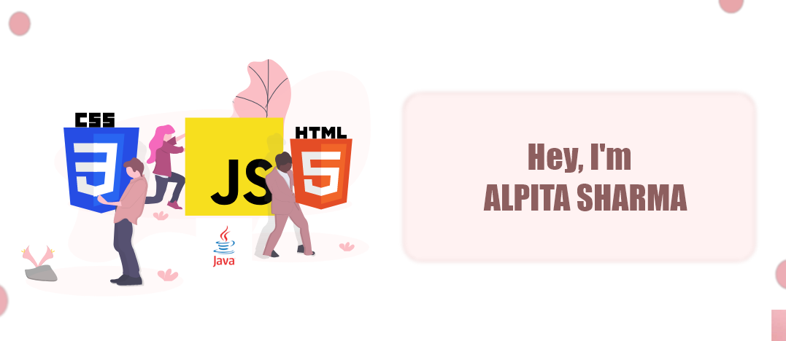

<h3 align="center" style="font-family:impact;"> Hi there!</h3>

I'm a backend developer with a strong foundation in server-side logic, database management, and API integration.With a problem-solving mindset, I aim to create efficient, reliable, and secure solutions that enhance user experience and support business goals

 <h4 align="center">
 🍀 <a href = "https://alpitaportfolio.netlify.app">Alpita's Portfolio</a> || 💬 connect <a href="https://www.linkedin.com/in/alpitasharma9">@alpita-sharma🌸</a>
</h4>
<!-- 

  <a href="https://alpitasharma2.github.io/myepitome/"> Do check out my portfolio</a>

   -->
<h3 align="left">Languages and Tools:</h3>

             

  

<!-- <h3 align="center">I'm a backend developer with a strong foundation in server-side logic, database management, and API integration.With a problem-solving mindset, I aim to create efficient, reliable, and secure solutions that enhance user experience and support business goals.</h3>

- 📫 How to reach me **alpita0908.dev@gmail.com**

- ⚡ Fun fact **you know your code is working perfectly if nobody ever notices it!**

<h3 align="left">Connect with me:</h3>

 -->

   
   
